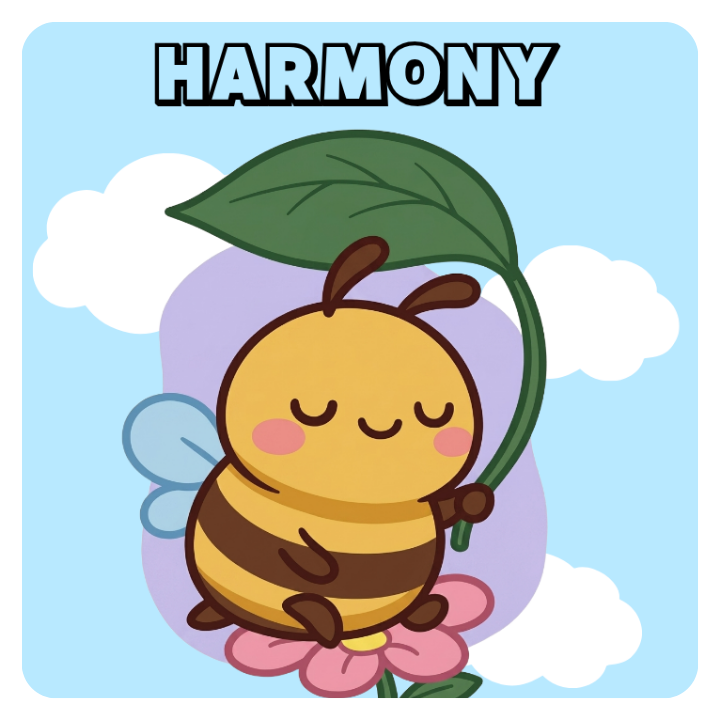

  

<h1 align="center">🐝 HARMONY</h1>

<b>H</b>ive <b>A</b>gent for <b>R</b>easoning over <b>M</b>ultimodal <b>O</b>bservations and e<b>N</b>vironmental d<b>Y</b>namics

<b>An Agentic Multimodal Framework for Intelligent Beehive Management</b>

  
  
  
  
  
  

---

# 🐝 Overview

**HARMONY** is an **Agentic Multimodal AI framework** for intelligent beehive monitoring and autonomous decision support.

Unlike conventional single-modal systems, HARMONY integrates **vision**, **audio**, and **environmental sensor** information through collaborative AI agents. By combining multimodal perception with reasoning, the framework continuously assesses colony health, detects abnormal hive conditions, predicts potential risks, and provides explainable recommendations for precision beekeeping.

---

# 🛠️ Tech Stack

| Category | Technologies |
|-----------|--------------|
| **Programming** | Python 3.11 |
| **Deep Learning** | PyTorch, TorchVision, TorchAudio |
| **Computer Vision** | OpenCV, YOLO |
| **Audio Processing** | Librosa, Torchaudio |
| **Data Processing** | NumPy, Pandas, Scikit-learn |
| **Visualization** | Matplotlib, Plotly |
| **Deployment** | Docker, Ubuntu Linux |
| **Version Control** | Git, GitHub |

---

# ✨ Key Features

## 🖼️ Vision Agent

- Queen bee detection
- Chalkbrood disease detection
- Brood stage recognition
- Bee population estimation
- Hive activity analysis

---

## 🎙️ Audio Agent

- Hive acoustic understanding
- Queenless colony detection
- Swarming prediction
- Stress sound analysis
- Colony activity estimation

---

## 🌡️ Environmental Agent

- Temperature monitoring
- Humidity monitoring
- CO₂ analysis
- Weather-aware reasoning
- Seasonal environmental analysis

---

## 🤖 Reasoning Agent

- Cross-modal reasoning
- Multimodal information fusion
- Colony health assessment
- Risk prediction
- Explainable decision making

---

